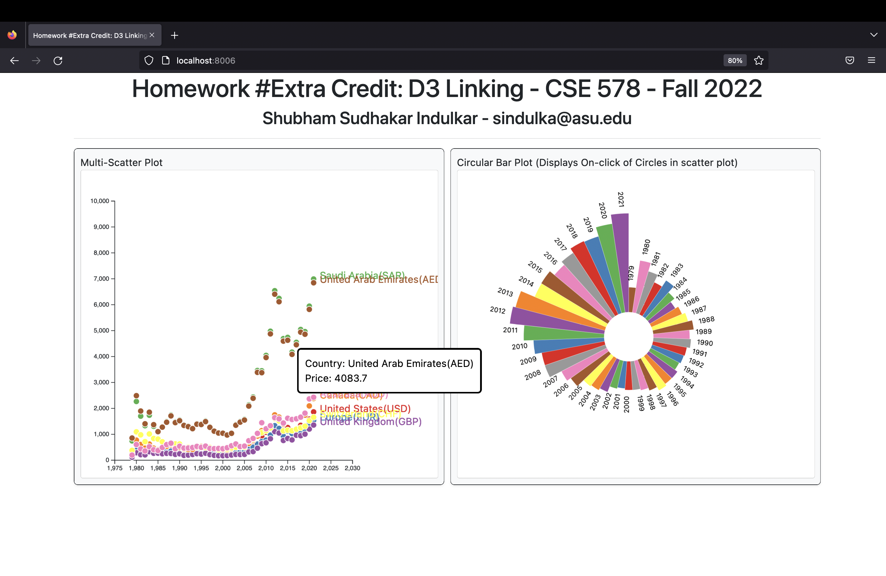
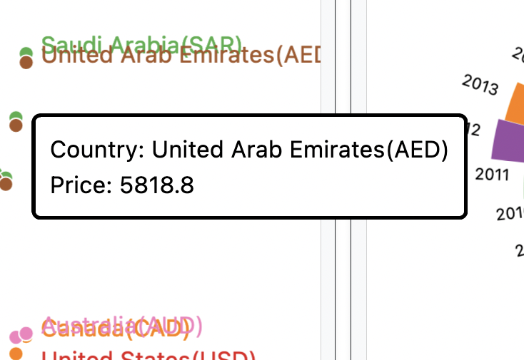

# Homework #Extra-: Linking Charts and Adding Interactivity

The purpose of this homework is to give you practice interactively building and linking visualizations together in D3. By the end of this assignment you should be able to:

- Dynamically create and parse a CSV dataset in JavaScript
- Plot values in a Multi-Scatter chart
- Plot values in a Circular Bar chart
- Dynamically update a chart based on user interactions
- Add a tooltip

The screenshot below shows an example of what your finished interface will look like.

## Overview

The starter code for this assignment shows two panels on the `index.html` page. The right panel shows a multi-scatter chart. The multi-scatter chart will visualize the distribution of the Gold Prices of 8 countries from 1979-2021. Hovering over the circles of scatter plot will show the country name and gold price at that particular year. Clicking on a circle will show a distribution of gold prices from 1979-2021 with the help of a circular bar chart.

## Data Description

The data has a Year column to show the dates(years) from 1979-2021. After that we have 8 columns for each of the 8 countries and their respective gold prices. Data is bundled in a csv so further data wrangling might be need to make use of the date and prices respectively.

## To complete the assignment

- Clone this code template to your local machine.
- Start a local server and open the `index.html` page.
- Modify the given code according to the instructions below to achieve the requested interface.
- Commit and push the code back to this repository to submit it.

## Step 0: Starting code

When you first run the page, you should see the empty interface. Add your name and email to the top. It's up to you if you want to write your JavaScript code in a separate JS file, or in the main `index.html` file.

## Step 1: Data Wrangling
- You'll want to first read the CSV data and store it in a set of one or more data structures. Every time the page reloads, you should have the updated data if there are any changes. Make sure you format the data such that it can be used for both the charts

## Step 2: Displaying a Multi-Scatter chart

On the reload of a web-page a muti scatter chart should be displayed for the 8 countries from 1979-2021 showing their gold prices.

- Your Mutli-Scatter chart should be centered inside the left side svg. You may choose the size of the axis,cicles, but make sure the circles should not go outside of the `svg`'s bounds, and also that the circles are not too fat/skinny.
- Choose a categorical d3 color scale for this chart by picking a color scale from [https://github.com/d3/d3-scale-chromatic](https://github.com/d3/d3-scale-chromatic). For my screenshots, I'm using the `d3.schemeSet1` scale, but you can choose any categorical scale you like.
- Make sure the x-axis starts from 1979 and ends at 2021. Choose the maximum value scale for y-axis.
- Make sure you add labels for each country at the end of circle of year 2021.
- When the user clicks on a circle multi-scatter chart, perform follwing actions: Take the data for the country that scircle is associated with and draw a circular bar chart labeled from 1979-2021 for the gold prices of that country.

| 🔍 **Hint:** Here's is examples of making donut charts: [https://d3-graph-gallery.com/graph/connectedscatter_multi.html](https://d3-graph-gallery.com/graph/connectedscatter_multi.html). Note that the second chart uses an older version of D3, but the syntax is similar.

## Step 3: Displaying a circular bar chart

When the user clicks on a circle in the multi-scatter chart, draw a circular bar chart in the right panel. The bar chart should be centered in the panel (with a reasonable margin, similar to the screenshot above), and show the labels of year. For example, if you click on the 'United States' circle in the multi-scatter chart, the circular bar chart will show gold prices of United States from 1979-2021.

- Make sure you choose proper inner radius for this plot so that it won't go out of svg bound. You can also add color scale for this chart.
- If the user clicks another country's circle, make sure you clear the svg and plot the new circular bar plot in the same place.

## Step 4: Add a hover tooltip to the multi-scatter chart

Finally, let's add a tooltip to the multi-scatter chart. When the user hovers over a circle, we'll display the exact price for that country in respective year.

The tooltip should show the current letter that's being hovered and its count, styled like the below picture (e.g., white background, black rounded border with a proper width). The tooltip should follow the user's mouse as it moves along the bar, and disappear when it's no longer over the bar. You'll want to use mouse events to control this functionality (`mouseover`, `mousemove`, `mouseout`). 

| 🔍 **Hint:** There are multiple ways to implement tooltips. One option is defining a div that's hidden unless you are hovering over a bar; when that happens, you populate the div with the necessary info, change its display to visible, and move it to the appropriate position on the so it follows the mouse's x/y position on the page. See  this page which for an example: [https://bl.ocks.org/d3noob/97e51c5be17291f79a27705cef827da2](https://bl.ocks.org/d3noob/97e51c5be17291f79a27705cef827da2).

## Grading

